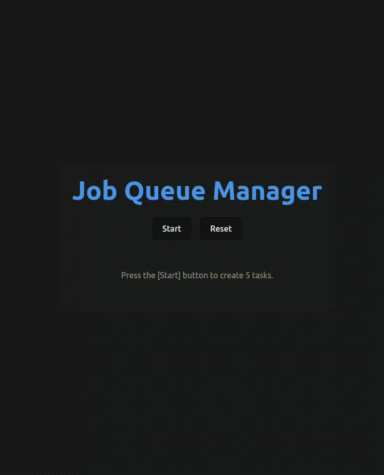

# Job Queue Test [Interview Exercise]

## Overview

In this challenge, you will implement a sequential promise queue system that ensures promises are executed one after another rather than concurrently. You will create a job management system that can add, execute, and cancel jobs in a controlled manner.

## Example

## Core Requirements

### 1. Sequential Job Execution

- Design a system that executes asynchronous jobs one after another, not concurrently
- Each job should only begin after the previous job has completed
- Jobs may take varying amounts of time to complete
- The system should return results from each job via promises

### 2. Job Cancellation Mechanism

- Implement functionality to cancel jobs that haven't started execution yet
- Cancellation of one job should not affect the execution of other jobs
- The system should handle cancellation gracefully without breaking the job chain

### 3. Failed Job Recovery System

- Implement a secondary queue system (Dead Letter Queue) to handle failed jobs
- When a job in the main sequential queue fails, it should be moved to this recovery queue
- The recovery queue should process failed jobs with configurable retry, delay options
- Failed jobs should be processed independently from the main job queue

## Functional Requirements

- Add Jobs: Allow adding new jobs to the queue at any time
- Job Execution Control: Execute jobs in the exact order they were added
- Job Results: Each job should return a result that callers can access
- Cancel Jobs: Support cancellation of specific jobs before they begin execution
- Error Handling: Properly handle and propagate errors from failed jobs
- Failed Job Recovery: Move failed jobs to a recovery queue with retry capabilities
- Retry Configuration: Support configurable retry parameters (delay, max attempts, priority)
- Recovery Workers: Implement a worker pool for parallel processing of recovery jobs

## Constraints

- Complete the challenge within 1 hour
- No external libraries for promise management
- Focus on functionality rather than UI implementation
